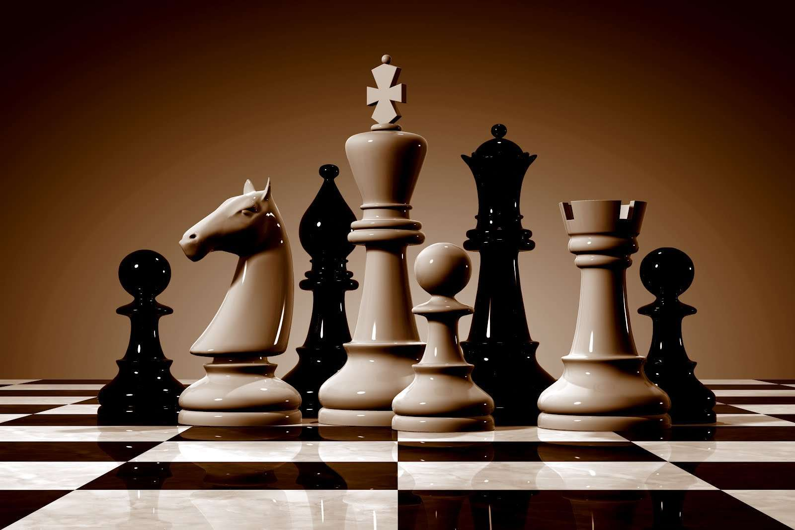

# Local Multiplayer Chess Game

Project for Local Multiplayer Chess Game built in Unreal Engine 4 with C++.

## Features

	- Chess piece moving, eating
	- Players take turns
	- Win condition, draw condition
	- Allowable moves with highlight and prediction
	- End Screen, Pause Menu
	- Reset Game
	- History of moves on HUD
	- Undo Moves
	- Save and Load Game
	- Special Move En Passant
	- Special Move Castling
	- Special Move Promotion (Queening)
	
**Unreal Engine 4 Version: 4.27**

